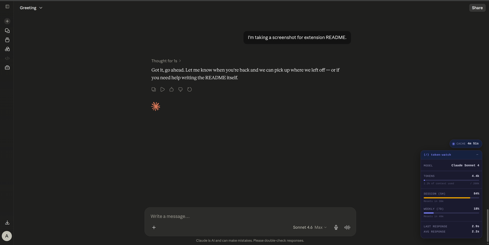
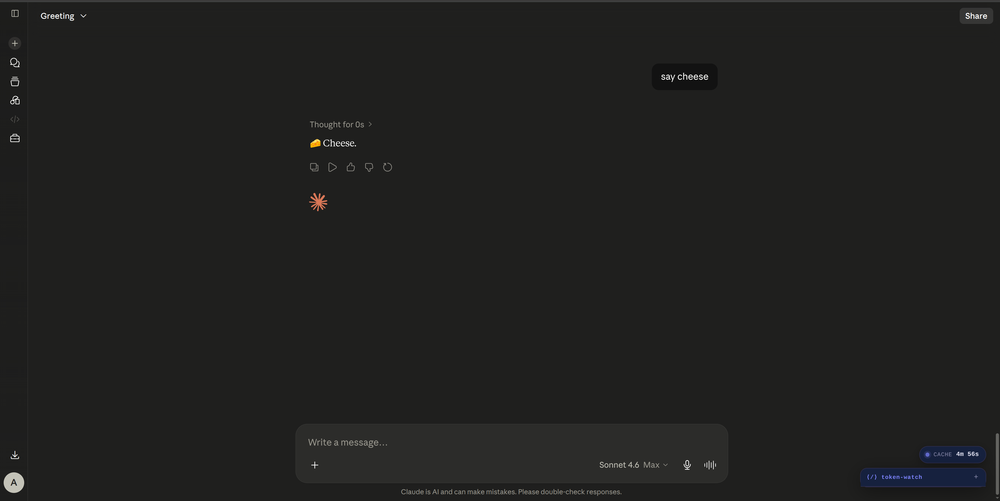

# Token Watch

A complete dashboard for monitoring your Claude usage in real-time. Sits in the corner of claude.ai and tracks tokens, context window, cache state, session/weekly limits, and Claude's response times.

  

## Preview

**Full dashboard** — stacked sections for every metric, with progress bars and reset countdowns. Cache pill appears above the panel when the conversation cache is active.



**Collapsed** — minimize to a small header bar when you need the screen space.



## Features

- **Token Counter** - Live approximate token count with progress bar against the 200k context limit
- **Compaction Awareness** - When raw conversation exceeds 200k, shows `raw` + `active ~200k · compacted`
- **Cache Pill** - A separate floating pill above the panel showing how long the conversation cache remains active (it pulses while active, disappears on expiry)
- **Model Detector** - Auto-detects which Claude model is active
- **Session & Weekly Usage** - Real usage percentages from Claude's native API with reset countdowns (formatted as `1d 8h 23m` for longer durations)
- **Response Timer** - Tracks last and average Claude response time
- **Alert System** - Yellow/red warnings as you approach context limits
- **Settings Page** - Customizable thresholds and toggleable features
- **No Token Usage** 

## Install

### Easy install (Chrome / Edge)

1. Download [`token-watch-1.0.1.zip`](https://github.com/CRAzyAbd/token-watch/releases/latest/download/token-watch-1.0.1.zip)
2. Open `chrome://extensions` and enable **Developer mode**
3. Drag the ZIP onto the page

### From source

1. Clone this repo
```bash
   git clone https://github.com/CRAzyAbd/token-watch.git
```
2. Open `chrome://extensions` → enable **Developer mode**
3. Click **Load unpacked** and select the `token-watch` folder
4. Open claude.ai — dashboard appears in the bottom-right

## Project Structure

<pre>
token-watch/
├── icons/                        # Extension icons
├── screenshots/                  # README screenshots
├── src/
│   ├── modules/
│   │   ├── tokenCounter.js       # Token counting logic
│   │   ├── usageTracker.js       # Claude /usage API fetcher
│   │   ├── modelDetector.js      # Active model detection
│   │   ├── responseTimer.js      # Response time tracker
│   │   └── cacheTimer.js         # Cache window countdown
│   ├── content.js                # Main UI injection script
│   ├── background.js             # Service worker
│   └── styles.css                # Dashboard styles
├── popup/                        # Extension popup
├── settings/                     # Settings page
└── manifest.json
</pre>

## Privacy

All data stays local — no external servers, no tracking. Only makes requests to `claude.ai`.

## License

MIT
